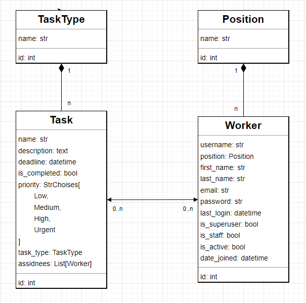

# Task manager
Task Manager is a web application designed to help organizations manage tasks, assign them to workers, and track their progress. This README provides an overview of the application's features, installation instructions, and usage guidelines.

## Check it out
[Task manager project deployed on Render](https://task-manager-hdpn.onrender.com)

## Features

    Task Type: Define different types of tasks (e.g., "Development", "Design", "Testing") to categorize tasks based on their nature.

    Position: Define various positions or roles within the organization (e.g., "Software Engineer", "Project Manager").

    Task: Create tasks with detailed information such as name, description, deadline, priority, and assign them to workers.

    Worker: Manage workers within the organization, assign tasks to them, and track their progress.

## DB schema
The Task Manager application uses a relational database to store information about task types, positions, tasks, and workers. The database schema consists of the following tables



## Installation
1. Clone the repository to your local machine:
```bash
git clone https://github.com/anrozhna/task-manager.git
```
2. Create a virtual environment:
```bash
python -m venv venv
```

3. Activate the virtual environment:

On Windows:
```bash
venv\Scripts\activate
```
    
On Mac:
```bash
source venv/bin/activate
```

4. Install dependencies
```bash
pip install -r requirements.txt
```

5. Perform database migrations:
```bash
python manage.py migrate
```
6. Run the development server:
```bash
python manage.py runserver
```

## Usage
1. Log in to the Task Manager application using the provided credentials.
2. Navigate to the admin panel (http://127.0.0.1:8000/admin) to manage existing task types, positions, tasks, and workers.
3. Review and update task types and positions as per your organization's requirements.
4. Review the existing workers, ensuring they have the correct permissions and information to log in to the system.
5. Create new tasks and assign them to the existing workers as needed.
6. Workers can log in to the application to view assigned tasks, update task statuses, and mark tasks as completed.

## Technologies used
1. Django: A high-level Python web framework that encourages rapid development and clean, pragmatic design.
2. HTML/CSS: Standard markup and styling languages used for creating the application's user interface.
3. Bootstrap: A front-end framework for developing websites.
4. SQLite: A lightweight relational database management system used for storing application data during development and testing.
5. Django Testing Framework: Built-in testing framework provided by Django, including TestCase for writing unit tests.
